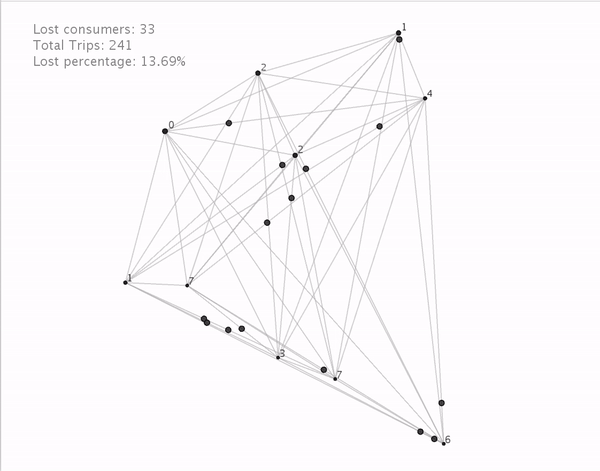

[Github repository](https://github.com/opt-mod/opt-mod.github.io)

[Website](https://opt-mod.github.io)

[Slides](https://opt-mod.github.io/show.html)

### Shared-Vehicle Mobility-On-Demand Systems: Modeling and Optimization of Rebalancing Empty Vehicles over Hub-based Network  

> **Abstract.** In this project, we consider the operation of automated mobility-on-demand systems. where the mobility service of self-driving automated vehicles are shared by customers across different time. In this systems, redirecting after-service fleet to periodically match the upcoming demand plays an important role to guarantee service level as well as fleet utilization. Specifically, we approach this problem with a hub-based network model, where demand and traffic flow are generated with some pre-known demographic information. We track the fleet level at each hubs across different time period and come up with optimal rebalancing solution to redirect empty fleets using some key performance metrics, such as aggregated rebalancing travel time. Via simulation, we provide performance evaluation by comparing different rebalancing policies with different fleet size. We found that rebalancing benefits the system most when certain information of the future demand could be predicted.

#### Introduction

In recent years, it is not hard to see the increasingly urbanized world gradually complicating people’s sustainable access to mobility service. The increase of the ownership of vehicle, due to higher demand of transportation, gives greater pressure to our road networks and other supporting infrastructure. Although expand parking spend and transportation network system might temporarily resolve the issue, problems related to cost and limited spatial resources make it not desirable to do so. It is also been pointed out that traffic demand may also increase along with larger traffic system and resolving inefficient utilization of the vehicles can powerful reduce congestion in a sustainable way.  

Thanks to the blooming of shared-economy market and advancements in mobility technology, it becomes possible to increase the utilization of vehicle through sharing the accessibility across different time. Considering the cost of car ownership and future maintenance, it is more attractive to use the on-demand mobility service rather than rely on self-owned vehicles, which are also often under-utilized. For example, consider the following mobility-on-demand (MoD) system. Passengers or users can access mobility by sharing a fleet with other across different time period. Using their cell phone, a user can reserve and pick up a nearby vehicle, drive to the destination and return the vehicle back to the system. The pickup and drop off location are not necessary the same. In compare with public transit, MoD system is more flexible to accommodate different trip types and also gives more freedom.  

From the perspective of on-demand mobility service provider, ensuring passenger to have reliable access to mobility service become really important for the business. It raises the attention to consider how dynamic operation would benefit both the business and the passenger. The short time window, between demand showing up and leaving away, is one of the main challenges to most mobility service provider. Instead of investing on a larger fleet size to lowering the possibility of losing demand, cleverly operating the system based on certain known information might be the key to resolve the challenge. The more sharing it can be achieved for over a single vehicle across time, the larger reduction on congestion and better business performance it could possible achieve. Moreover, sharing the vehicle could also reducing energy consumption and carbon emission by reducing the total number of vehicles in system. 

#### Illustrations
We created a simulation to observe the results graphically. 

In the animation, the fixed points are the hubs, it's radius indicates the number of avaiable vehicle in each hub. Every hub are connected to each other. The black circles represent vehicles that are carrying consumer from one hub to the other. The circles in blue represent the vehicles that are being rebalanced to other hubs. When the remaining vehicles in a hub reaches a critical points, rebalancing happens. 

#### Background

The carsharing system, which was original from Europe in mid nineteenth century, started gaining prominence in American since the 90's. Some early work has been conducted to learn the market for carsharing services, with focus to relate customer interest in such services to demographics [14], urban geography [15,16], and the quality of mobility service [17].The advancements of autonomous vehicle technology in recent years brought inspired car-sharing researchers to incorporate the unique functionality associated with self-driving cars, such as less variable cost and high routing flexibility, into the shared mobility models. More light has been shed on the need to relocate empty vehicles in car sharing systems in couple of years. Some researchers used a user-based solution for rebalancing vehicles, where they considered the effect of economics incentives on drivers driving decision, while others assumes operational rebalancing power of the mobility service platform over individual drivers [19,20]. Different approach ranges from agent-based models [21] to mathematical models [22]. However, the operational result from both ways close depend the cost of human labor resource and it may not be impartial to implement in real life. Therefore, considering automated vehicle become more demanding, since vehicles are capable of repositioning themselves. A more detailed literature review could be found in Spieser and Samaranayake's paper.

#### Problem Formulation

In this section, we first provide the notation and terminology used to describe the AMoD system we considered. We then formulate the vehicle rebalancing task as a linear program. 

##### AMoD System Setup

We consider a spatially embedded, hub-based network model $H = (V_H,E_H)$, with $N$ hubs and let $x_i \in \mathbb{R}^2$ be the location of hub $i$. Denote the travel time between hubs $i$ and $j$ to be $T_{ij} > 0$. Here we assume a network of cluster one, which guarantees there is no isolation location in the network. For example, we can model a given city as a network format by selecting the starting and ending locations of popular trips as the hubs. Take Minneapolis as an example, we could let the hubs mainly be restaurants, supermarkets, residential blocks and office buildings, with additional choice of airports, universities, shopping malls, so and so forth. In such a way, the traffic could be effectively transformed to a network model without losing much tract of real situation. 

The demand for mobility service is modeled based on the above network, where demand initialized around a given hub is aggregated to be the demand of the hub. Each customer that enters the system represents a demand of trip is described by a triple $(i,j,t)$, where $i, j \in V $ are the origin and destination of the desired trip and $t$ is the time of demand arrival. Let $\lambda_{i} (t)$ be the rate of customer arrival at hub $i$ at time $t$, which satisfies $$ \lambda_i(t) = \sum_j {\lambda_{ij}(t)}, ~ \forall ij \in E, ~ t \geq 0,$$where $\lambda_{ij}(t)$ is the arrival rate of customer going from $i$ to $j$ at time $t$. To capture the demand over time, we let $q_i(t)$ be the total number of demands waiting at hub $i$ at time $t$. We assume a first-come-fist-serve policy. 

Here we assume the rebalancing of vehicles are carried out periodically. Let $T_p$ be the time cycle between two consecutive rebalancing. At the rebalancing time, each hub maintains a set of rebalancing tasks, where each task at hub $i$ is represents by $(j,z) \in V \times \mathbb{Z}$, meaning sending $z$ empty vehicles from hub $i$ to hub $j$. Rebalancing tasks are served based on first-come-first-serve policy. We assume that fulfilling customer demand have higher priority than rebalancing tasks, which means system will first match empty vehicles to queueing customers and then perform rebalancing tasks using the remaining empty vehicles. 

Demand for trips are served by a total $n$ number of autonomous vehicles. At a given time point, a vehicle will either be severing customers, conducting rebalancing task, or parking at a hub. Let $v_i(t)$ be the total number of vehicle parked at hub $i$ at time $t$. Similarly, we denote $v_{ij}(t)$ as the total number of vehicles en route from hub $i$ to $j$ at time $t$, which consists of vehicles either servering customers or completing rebalancing. In summary, we have $$ n = \sum_{i t\in V} v_i(t) + \sum_{ij \in E} v_{ij}(t).$$

The objective of the mobility service provider is to have a higher service level with less work of rebalancing. To capture the service level, we assume each customer will stay in the system for a given amount of tolerance time $t_max$ before his or her trip request is served. The customers who did not get served after waiting for $t_max$ amount of time will leave the system immediately and generate a $walk-away$. We denote the total number of walk-aways over the period of interest to be $C_{wa}$.

Here is the sequence of events happened at a given hub $i$ at given time $t$,  we are interested to track. First, demand generate according to arrival rate $\lambda_i$ and number of customer reached their tolerance time is determined. Second, customer queue size $q_i(t)$ is updated according to the number of arriving and reneging customers. Then, certain number of vehicles from each hub $j (\neq i)$ to $i$ arrived and $v_i(t)$ is updated. The arrived vehicles consists of both the customer-serving vehicles and the empty rebalancing vehicles. After that, the system matches the queueing demand and the parked vehicles to create departures, which is followed by updating customer queue $v_i(t)$, parked vehicles $v_i(t)$, vehicles departures $v_{ij}(t)$, and the waiting time of customers that are still in queue. Lastly, with respect to certain performance metric, compute the optimal number of rebalancing vehicles going from hub $i$ to $j$ constrained by $v_i(t)$ and then update $v_{ij}(t)$ accordingly. 

##### Rebalancing Optimization 

In the above session, we describe the mechanism of how AMoD systems works and what information is required to known before perform vehicle rebalancing. For the time being, we assume the fleet operator has perfect knowledge of $\lambda_{ij}(t)$, $q_i(t)$, $v_i(t)$, and $v_{ij}(t)$. To formulate the rebalancing optimization problem, we introduce the following variables. For each pair of hubs $(i,j) \in E$, denote $n_{ij}$ to be the number of empty vehicles we decided to send from $i$ to $j$ at the time of considering $t$. Let $n_i^{exc}$ and $n_i^{des}$ denote the number of $excess$ and $desired$ vehicles, which are specified later. 

Then we have the following rebalancing optimization problem formed as an linear programming. 

$$
\begin{array}{ll@{}ll}    
\underset {n_{ij}} {\max}  & \sum\limits_{ij \in E} T_{ij} n_{ij} \\\\
   \mathrm{s.t.} & \sum\limits_{j} {n_{ji}} - \sum\limits_j {n_{ij}} \geq n_i^{des} - n_i^{exc} , i \in V \\\\                 
& n\_{ij} \geq 0 , ij \in E  
\end{array}
$$

The objective is to minimize the total amount of effort to conduct empty vehicle rebalancing, which is in measure of the travel time. It has to be satisfied that the amount of net inbound rebalancing vehicles at hub $i$ should be larger or equal than what hub $i$ desired minus what it had (or will have) access to. In other words, there will be $n_i^{des}$ vehicles after all rebalancing trips are accounted for. Depends whether we include the vehicles to $i$ as part of excess vehicles, there are two ways in selecting $n_i^{exc}$, shown as $$n_i^{exc}(t) = v_i(t) + \sum\limits_j{v_{ji}(t)} ~~  \text{or} ~~ n_i^{exc}(t) = v_i(t).$$Here we will use the first one to such that our rebalancing decision considered the upcoming vehicles as available for repositioning. It is important to point out that the empty vehicle will not be redirect to new hubs when they are traveling between two hubs, even through it may not be the case in reality, where changing destination can be done instantaneously after commend. For convenience, we denote $m$ as the total number of excess vehicles in the system, which is $$m = \sum\limits_{i \in V} {n_{i}^{exc}}.$$

Next, we choose $n_i^{des}$, which is relatively feasible to determine compared with $n_i^{exc}$. The choice of $n_i^{des}$, will very much influence the result of optimization problem shown above, since the number desired vehicles determine to how much rebalancing is required. To guarantee the feasibility of the rebalancing problem, we required $$\sum\limits_i {n_i^{des}} \leq m,$$ which says the number of fleet used for rebalancing should not exceed what is available. We use the following two ways to model the number of excess vehicles. 

The first is pure feedback rebalancing. As the name indicated, the number of vehicles being repositioned is just equal to the outstanding demand cumulated over one cycle of the time $T_p$. The desired vehicle is purely determined solely by the system states at each rebalancing time. Denote the outstanding demand by $Q(t) = \sum\limits_{i \in V} {q_i(t)}$. When $Q(t)$ is less than $m$, all the outstanding demand could be matched through rebalancing. When $Q(t)$ is larger than $m$, we will match the outstanding demand partially at each hub according to its proportion over $Q(t)$. Mathematically, we got 

$$n_i^{des}(t) = \begin{cases} q_i(t) & , Q_i(t) \leq m \\\frac{q_i(t)}{Q_i(t)} ~m& , otherwise \end{cases} $$

The advantage of feedback rebalancing lies in the limited information it requires from the system, which is only the current knowledge of the system status. It is simple and most effective when demand does not vary in a negative correlated way between hubs right after the rebalancing. 

In the second way, we used a feedback + proportional predictive rebalancing method. We tried to utilize the information of historical demand we acknowledge. Instead of rebalancing purely based on what is required at the given time, the operator could predict the future demand and make better vehicle rebalancing by capturing also the potential future outstanding demand. More specifically, when $Q_i(t) < m$, instead of just reallocating $q_i(t)$ to hub $i$, part of the additional amount of empty vehicle $m' = m - Q_i(t)$ will be assigned to go to hub $i$. The proportion of this additional amount that goes hub $i$ is determined by the proportion of near future demand over the entire system, i.e $\frac {\lambda_i(t,\tau)} {\sum\limits_{j \in V} {\lambda_j(t,\tau)}}$, where ${\lambda_i(t,\tau)}$ is the predicted demand over the look-ahead time window $[t, t+\tau]$ at hub $i$. Mathematically, we got 

$$n_i^{des}(t) = \begin{cases} q_i(t) + \frac {\lambda_i(t,\tau)} {\sum\limits_{j \in V} {\lambda_j(t,\tau)}} m'& , Q_i(t) \leq m \\\frac{q_i(t)}{Q_i(t)} ~m& , otherwise \end{cases} $$

Indeed, this method requires certain information about future demand compared with the pure rebalancing method. It is not hard for mobility service provider to infer the near future demand by using the past data. The value of $\tau$ may play an crucial role in determine the model performance. If $\tau$ is too small, we could not capture the benefit by using the future demand information. If $\tau$ is chose to be too large, we may overly determined by the demand yet not to realize. 

When implement either of the models above, we assume the value of $T_p$ is pre-determined. It is not difficult to see the frequency of vehicle rebalancing has significant influence on performance. Too large a $T_p$ dose serve the purpose to dynamically match demand and supply, where demand lost before the rebalancing vehicles arrives. While too little a $T_p$ will lead to inefficient balancing, where you may result in rebalancing vehicles from both hub $i$ to $j$ and $j$ to $i$ at the same time. 

#### Simulation Result

#### Conclusion and Future Improvement

#### Reference
